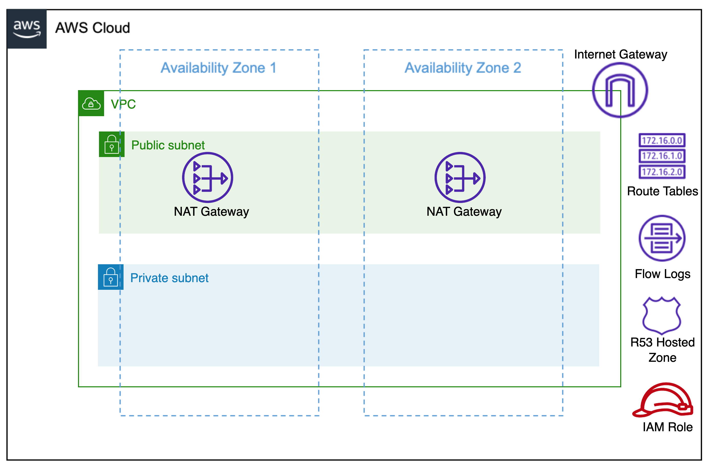

# terraform-aws-budget-mudule
This module will help you to create AWS VPC resource.

Architecture


## Usage
```hcl
module "aws_budget" {
  source            = "git::https://github.com/rajdeep617/terraform-aws-vpc-module.git"
  budgets           = var.budgets
  time_period_start = var.time_period_start
  notification      = var.notification
}
```

## Examples
Refer to the [examples](https://github.com/rajdeep617/terraform-aws-vpc-module/tree/master/examples) directory in this GitHub repository for complete terraform code example.

## Known issues

No known issues.

## Requirements

| Name | Version  |
|------|----------|
| <a name="requirement_terraform"></a> [terraform](#requirement\_terraform) | >= 1.0.0 |
| <a name="requirement_aws"></a> [aws](#requirement\_aws) | >= 3.29  |

## Providers

| Name | Version |
|------|---------|
| <a name="provider_aws"></a> [aws](#provider\_aws) | >= 4.0  |

## Modules

No modules.

## Resources
| Name                                                                                                                          | Type     |
|-------------------------------------------------------------------------------------------------------------------------------|----------|
| [aws_vpc.main](https://registry.terraform.io/providers/hashicorp/aws/latest/docs/resources/vpc)             | resource |
| [aws_internet_gateway.main](https://registry.terraform.io/providers/hashicorp/aws/latest/docs/resources/internet_gateway)             | resource |
| [aws_nat_gateway.main](https://registry.terraform.io/providers/hashicorp/aws/latest/docs/resources/nat_gateway)             | resource |
| [aws_subnet.public-subnets](https://registry.terraform.io/providers/hashicorp/aws/latest/docs/resources/subnet)             | resource |
| [aws_route_table.public-rt](https://registry.terraform.io/providers/hashicorp/aws/latest/docs/resources/route_table)             | resource |
| [aws_route_table_association.public](https://registry.terraform.io/providers/hashicorp/aws/latest/docs/resources/route_table_association)             | resource |
| [aws_subnet.private-subnets](https://registry.terraform.io/providers/hashicorp/aws/latest/docs/resources/subnet)             | resource |
| [aws_route_table.private-rt](https://registry.terraform.io/providers/hashicorp/aws/latest/docs/resources/route_table)             | resource |
| [aws_eip.ngw](https://registry.terraform.io/providers/hashicorp/aws/latest/docs/resources/eip)             | resource |
| [aws_route.ngw](https://registry.terraform.io/providers/hashicorp/aws/latest/docs/resources/route)             | resource |
| [aws_route_table_association.private](https://registry.terraform.io/providers/hashicorp/aws/latest/docs/resources/route_table_association)             | resource |
| [aws_vpc_dhcp_options.internal](https://registry.terraform.io/providers/hashicorp/aws/latest/docs/resources/vpc_dhcp_options)             | resource |
| [aws_vpc_dhcp_options_association.internal](https://registry.terraform.io/providers/hashicorp/aws/latest/docs/resources/vpc_dhcp_options_association)             | resource |
| [aws_route53_zone.internal](https://registry.terraform.io/providers/hashicorp/aws/latest/docs/resources/route53_zone)             | resource |
| [aws_flow_log.vpc](https://registry.terraform.io/providers/hashicorp/aws/latest/docs/resources/flow_log)             | resource |
| [aws_cloudwatch_log_group.flow-logs](https://registry.terraform.io/providers/hashicorp/aws/latest/docs/resources/cloudwatch_log_group)             | resource |
| [aws_iam_role.flow-logs](https://registry.terraform.io/providers/hashicorp/aws/latest/docs/resources/iam_role)             | resource |
| [aws_iam_role_policy.flow-logs](https://registry.terraform.io/providers/hashicorp/aws/latest/docs/resources/iam_role_policy)             | resource |

## Inputs
| Name                                                                                                                | Description                                   | Type           | Default | Required |
|---------------------------------------------------------------------------------------------------------------------|-----------------------------------------------|----------------|---------|:--------:|
| <a name="name_tag"></a> [name\_tag](#name\_tag)                                                                     | The value of name tag to used on all resources | `string`       |         |   Yes    |
| <a name="vpc_cidr"></a> [vpc\_cidr](#vpc\_cidr)                                                                     | IPv4 CIDR for VPC                             | `string`       |         |   Yes    |
| <a name="azs"></a> [azs](#azs)                                                                                      | List of availability zones names              | `list(string)` |         |   Yes    |
| <a name="enable_dns_hostnames"></a> [enable_dns_hostnames](#enable\_dns\_hostnames)                                 | Should enable DNS hostname                    | `bool`         | true    |    No    |
| <a name="enable_dns_support"></a> [enable_dns_support](#enable\_dns\_support)                                       | Should enable DNS hostname                    | `bool`         | true    |    No    |
| <a name="instance_tenancy"></a> [instance_tenancy](#instance\_tenancy)                                              | Instances tenancy to launch into the VPC"     | `string`       | default |    No    |
| <a name="create_public_subnets"></a> [create_public_subnets](#create\_public\_subnets)                              | Should create public subnets                  | `bool`         |         |   Yes    |
| <a name="create_private_subnets"></a> [create_private_subnets"](#create\_private\_subnets")                         | Should create private subnets                 | `bool`         |         |   Yes    |
| <a name="create_internet_gateway"></a> [create_internet_gateway](#create\_internet\_gateway)                        | Should Create Internet Gateway                | `bool`         |         |   Yes    |
| <a name="create_nat_gateway"></a> [create_nat_gateway](#create\_nat\_gateway)                                       | Should Create Nat Gateway                     | `bool`         |         |   Yes    |
| <a name="shared_ngw"></a> [shared_ngw](#shared\_ngw)                                                                | Should create a shared NAT Gateway            | `bool`         | true    |    No    |
| <a name="create_r53_private_hosted_zone"></a> [create_r53_private_hosted_zone](#create\_r53\_private\_hosted\_zone) | Should create private R53 hosted zone         | `bool`         | false   |    No    |
| <a name="r53_private_domain_name"></a> [r53_private_domain_name](#r53\_private\_domain\_name)                       | R53 private domain name                       | `string`       | null    |    No    |
| <a name="crate_flow_logs"></a> [crate_flow_logs](#crate\_flow\_logs)                                                | Should create VPC flow logs                   | `bool`         | false   |    No     |


## Outputs

| Name                                                                                     | Type        |
|------------------------------------------------------------------------------------------|-------------|
| <a name="output_vpc_id"></a> [vpc\_id](#output\_aws\_budget\_ids)                        | `string`      |
| <a name="private_subnets_ids"></a> [private\_subnets\_ids](#output\_private\_subnets\_ids) | `list(string)` |
| <a name="public_subnets_ids"></a> [public\_subnets\_ids](#output\_public\_subnets\_ids)  | `list(string)` |
| <a name="output_igw_id"></a> [igw\_ids](#output\_igw\_id)                                | `string`      |
| <a name="output_ngw_ids"></a> [ngw\_ids](#output\_ngw\_ids)                              | `list(string)` |

## Authors
Module managed by [Rajdeep Hayer](https://github.com/rajdeep617).